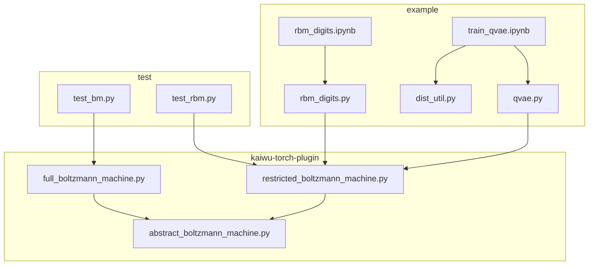

# Kaiwu-Pytorch-Plugin

**语言版本**: [中文](README_ZH.md) | [English](README.md)

Kaiwu-Pytorch-Plugin使用请参考[**文档**](https://kaiwu-pytorch-plugin-docs.readthedocs.io/zh-cn/latest/) 

## 项目简介

`Kaiwu-PyTorch-Plugin` 是一个基于PyTorch和Kaiwu SDK的量子计算编程套件，可基于玻色量子的相干光量子计算机来训练和评估受限玻尔兹曼机(Restricted Boltzmann Machines, RBM)和玻尔兹曼机(Boltzmann Machines, BM)。该插件提供了简单易用的接口，使研究人员和开发者能够快速实现能量神经网络模型的训练与验证，并应用于各种机器学习开发任务。

受限玻尔兹曼机是一种基于能量的无监督学习模型，由可见层和隐藏层构成，层间全连接但层内无连接。其核心思想是通过能量函数建模数据的概率分布，利用对比散度（Contrastive Divergence，CD）等算法训练权重，使模型能够学习输入数据的隐含特征。受限玻尔兹曼机常用于特征提取、降维或协同过滤，也是构建更复杂模型的基础。玻尔兹曼机是一种全连接的随机神经网络，所有神经元之间都可能存在连接（包括可见层和隐藏层内部），对于BM传统的采样方法效率较低，量子计算提供了一种新的方法。


上图是项目文件结构：
- kaiwu-torch-plugin部分的代码包含基类，受限玻尔兹曼机和玻尔兹曼机
- example部分的代码包含qvae生成数字和digits数字识别这两个示例
- test包含了单元测试


### 主要特性
- 量子支持：继承Kaiwu SDK，支持相干光量子计算机的调用
- PyTorch原生支持：无缝集成PyTorch生态系统，支持GPU加速计算
- 灵活的架构配置：支持自定义可见层和隐藏层维度
- 可扩展性：模块化设计，方便添加新的能量函数或采样方法

### 插件优势

- 灵活配置：将采样的方法和能量函数的过程分开实现，方便添加新的能量函数或采样方法。对使用广泛的BM和RBM进行实现，可以使用定义目标函数的方式集成到其他模型；
- 案例参考：插件提供相关的例子，如digits和qvae训练，可以作为实现自己工作的参考；
- 前沿算法支撑：插件为前沿算法的实现和应用提供了坚实的平台支持。如基于玻尔兹曼分布替代VAE高斯假设的创新方法，依托Kaiwu-PyTorch-Plugin实现。插件支持了模型的端到端训练，用于处理大规模、高噪声的单细胞数据，降低了算法开发和应用的门槛。

## 快速开始

### 安装要求
- python == 3.10
- kaiwu == v1.2.0
- torch == 2.7.0
- numpy == 2.2.6

### 代码风格

- 遵循PEP 8规范

### 安装步骤

1. **创建并激活环境**：
   ```bash
   # 推荐使用 conda 创建新环境
   conda create -n quantum_env python=3.10
   conda activate quantum_env
   ```

2. **克隆本仓库到本地**：
   ```bash
   git clone https://github.com/QBoson/kaiwu-pytorch-plugin.git
   cd kaiwu-pytorch-plugin
   ```

3. **安装依赖包**：
   ```bash
   pip install -r requirements/requirements.txt
   ```
   Kaiwu SDK需要单独安装，具体方法参考下方安装说明。

4. **安装**：
   ```bash
   pip install .
   ```

### Kaiwu SDK 安装说明（必需）

Kaiwu SDK下载链接和安装步骤如下：


1. **获取 SDK**：
   - 访问 [Kaiwu SDK 下载地址](https://platform.qboson.com/sdkDownload)（需要注册账号）
   - 查看 [Kaiwu SDK 安装说明](https://kaiwu-sdk-docs.qboson.com/zh/latest/source/getting_started/sdk_installation_instructions.html)

2. **配置授权信息**：
   获取您的 SDK 授权信息：
   ```
   用户ID: <your-user-id>
   SDK授权码: <your-sdk-token>
   ```
   > 请将以上信息替换为您的实际授权信息

### 获取真机调用资格

若需体验量子真机计算，请在 [相干光量子计算云平台](https://platform.qboson.com/) 注册账号，并参考文档下方官方工作人员联系方式获取真机配额。


## 案例示例

### 简单示例
下面是RBM调用的简单实例。该例子展示了接口的使用方法，不涉及具体的任务。

```python
import torch
from torch.optim import SGD
from kaiwu.torch_plugin import RestrictedBoltzmannMachine
from kaiwu.classical import SimulatedAnnealingOptimizer

if __name__ == "__main__":
    SAMPLE_SIZE = 17
    sampler = SimulatedAnnealingOptimizer()
    num_nodes = 50
    num_visible = 20
    x = 1 - 2.0 * torch.randint(0, 2, (SAMPLE_SIZE, num_visible))

    # Instantiate the model
    rbm = RestrictedBoltzmannMachine(
        num_visible,
        num_nodes - num_visible,
    )
    # Instantiate the optimizer
    opt_rbm = SGD(rbm.parameters())

    # Example of one iteration in a training loop
    # Generate a sample set from the model
    x = rbm.get_hidden(x)
    s = rbm.sample(sampler)

    opt_rbm.zero_grad()
    # Compute the objective---this objective yields the same gradient as the negative
    # log likelihood of the model
    objective = rbm.objective(x, s)
    # Backpropgate gradients
    objective.backward()
    # Update model weights with a step of stochastic gradient descent
    opt_rbm.step()
    print(objective)
```


### 分类任务：手写数字识别
展示利用受限玻尔兹曼机对手写数字数据集（Digits）进行特征学习与分类任务。该示例适用于初学者理解受限玻尔兹曼机在图像特征提取及分类场景中的应用流程，可作为后续进阶实验与功能扩展的基础。主要内容包括：
- 数据扩增与预处理：针对原始 8x8 像素的手写数字图像，通过上下左右平移操作扩展数据集，并使用 MinMaxScaler 进行归一化特征处理；
- RBM模型训练：实现 RBMRunner 类，对 RBM 的训练流程进行封装，训练过程中支持可视化生成样本与权重矩阵；
- 特征提取与分类：RBM训练完成后，利用其隐层输出的特征表示，通过逻辑回归进行分类评估；
- 可视化分析：支持训练过程中的样本生成与权重可视化功能，便于观察和判断模型学习效果。

运行该实例可以运行`example/rbm_digits/rbm_digits.ipynb`


### 生成任务：Q-VAE的MNIST图像生成

展示如何在MNIST手写数字数据集上训练和评估量子变分自编码器（Q-VAE）模型。该示例适用于希望理解Q-VAE模型训练、生成与评估流程的使用者，可作为生成模型后续研究的基础。主要内容包括：
- 数据加载与预处理：通过自定义数据集类实现支持批次索引，并结合ToTensor转换和展平操作；
- 模型构建：构建Q-VAE模型架构，包括编码器、解码器模块及RBM隐变量建模过程；
- 训练过程：设计和实现完整的训练循环，记录损失、证据下界（ELBO）、KL散度等指标，同时支持模型断点保存；
- 可视化与生成：提供原始图像、重构图像和生成图像的可视化对比方法，便于直观评估模型效果。

运行该实例可以运行`example/qvae_mnist/train_qvae.ipynb`


## 科研成果

### QBM inside VAE = 更强的数据表征生成器（QBM-VAE）
生物、化学、材料等自然世界产生的数据极其复杂，基于独立同分布的高斯假设往往造成模型表示的“失真”。

基于相干光量子计算机这一原生的玻尔兹曼分布采样器，可构建量子玻尔兹曼机（QBM）增强的深度变分自编码器（QBM-VAE）模型，大幅提升VAE的编码表征能力，使其能够捕获以往难以识别的深层数据特征。

在单细胞转录组学分析（一种在单细胞水平检测基因表达以揭示细胞异质性和功能差异的技术）中，QBM-VAE可显著提升聚类精度，检测到传统方法无法辨识的新型细胞亚型（具有独特特征的新致病因素），为靶点发现提供新线索。

基于此表征我们精确地完成了百万量级单细胞转录组数据整合，并基于更优的隐变量表示在细胞聚类，细胞分类，细胞轨迹分析等下游任务中取得了较其他现有方法更优的结果，验证了此隐变量表示的优越性。

如果你对该方法感兴趣，可以参考论文:  
[Quantum-Boosted High-Fidelity Deep Learning](https://arxiv.org/pdf/2508.11190)


## 致谢

- 感谢所有贡献者的宝贵贡献。
- 感谢量子计算社区贡献者的支持和反馈。

## 联系方式

1. 玻色量子开发者社区，获取更多学习资源
2. 玻色量子官方助手，真机申请及合作咨询
3. 邮箱联系方式：developer@boseq.com

   
