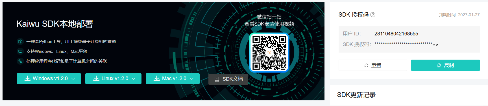
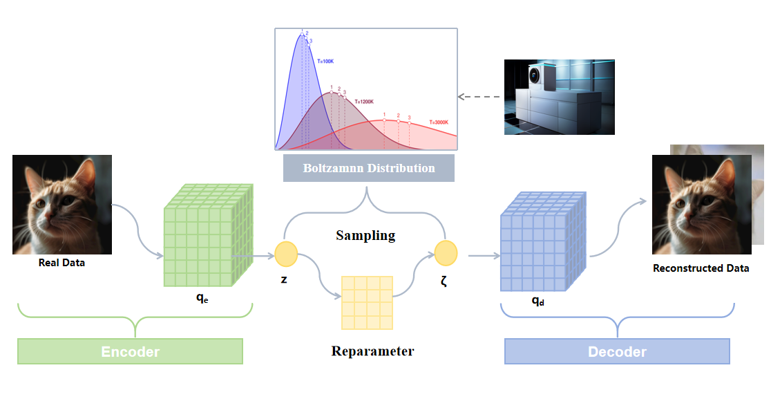

.. role:: raw-html(raw)
   :format: html

.. |python_badge| image:: https://img.shields.io/badge/Python-3.10%2B-blue
   :alt: Python Version
   :target: https://www.python.org/

.. |license_badge| image:: https://img.shields.io/badge/License-Apache%202.0-green
   :alt: License
   :target: https://opensource.org/licenses/Apache-2.0

|python_badge| |license_badge|

========================
Kaiwu-Pytorch-Plugin
========================

**Language Versions**: `Chinese <README_ZH.md>`_ | `English <README.rst>`_

------------------------
Project Overview
------------------------

``Kaiwu-PyTorch-Plugin`` is a quantum computing programming suite based on PyTorch and the Kaiwu SDK. It enables the training and evaluation of Restricted Boltzmann Machines (RBMs) and Boltzmann Machines (BMs) on coherent photonic quantum computers. The plugin provides easy-to-use interfaces, allowing researchers and developers to quickly implement the training and validation of energy-based neural network models and apply them to various machine learning development tasks.

A **Restricted Boltzmann Machine** is an energy-based unsupervised learning model consisting of a visible layer and a hidden layer, with full connections between layers but no connections within a layer. Its core idea is to model the probability distribution of data through an energy function and train weights using algorithms such as Contrastive Divergence (CD), allowing the model to learn hidden features of input data. RBMs are commonly used for feature extraction, dimensionality reduction, or collaborative filtering, and are also the foundation for building more complex models.

A **Boltzmann Machine** is a fully connected stochastic neural network where all neurons can be interconnected (including within the visible and hidden layers). Traditional sampling methods for BMs are inefficient, and quantum computing provides a new approach.

.. mermaid::

    graph TD
        subgraph kaiwu-torch-plugin
            bm[full_boltzmann_machine.py] -->abm[abstract_boltzmann_machine.py]
            rbm[restricted_boltzmann_machine.py] -->abm
        end
        subgraph example
            rbm_example_d1[rbm_digits.py] --> rbm
            rbm_example_d2[rbm_digits.ipynb] --> rbm_example_d1
            rbm_example_v1[qvae.py] --> rbm
            rbm_example_v2 --> rbm_example_v3[dist_util.py] 
            rbm_example_v2[train_qvae.ipynb] --> rbm_example_v1
        end
        subgraph test
            test_bm[test_bm.py] --> bm
            test_rbm[test_rbm.py] --> rbm
        end

The above diagram shows the project file structure:
- The ``Kaiwu-torch-plugin`` section includes base class, Restricted Boltzmann Machine, and Boltzmann Machine.
- The ``example`` section includes two examples: qvae for generating digits and digits for digit recognition.
- The ``test`` section contains unit tests.

------------------------
Main Features
------------------------

- **Quantum Support**: Inherits from Kaiwu SDK, supports calling photonic quantum computers
- **Native PyTorch Support**: Seamless integration with the PyTorch ecosystem, supports GPU acceleration
- **Flexible Architecture**: Supports custom visible and hidden layer dimensions
- **Extensibility**: Modular design makes it easy to add new energy functions or sampling methods

------------------------
Plugin Advantages
------------------------

- **Flexible Configuration**: Sampling methods and energy functions are implemented separately, making it easy to add new energy functions or sampling methods. Widely used BMs and RBMs are implemented, and can be integrated into other models by defining objective functions.
- **Example References**: The plugin provides relevant examples, such as digits and qvae training, which can serve as references for your own work.
- **Cutting-edge Algorithm Support**: The plugin provides a solid platform for implementing and applying cutting-edge algorithms. For example, innovative methods that replace the Gaussian assumption in VAE with a Boltzmann distribution are implemented based on Kaiwu-Pytorch-Plugin. The plugin supports end-to-end model training for large-scale, high-noise single-cell data, lowering the barrier for algorithm development and application.

------------------------
Quick Start
------------------------

Requirements
============

- Python == 3.10
- kaiwu == v1.2.0
- torch == 2.7.0
- numpy == 2.2.6

Code Style
==========

Follows PEP 8 standards.

Installation Steps
==================

1. **Create and activate an environment**:

   .. code-block:: bash

      # It is recommended to use conda to create a new environment
      conda create -n quantum_env python=3.10
      conda activate quantum_env

2. **Clone this repository locally**:

   .. code-block:: bash

      git clone https://github.com/QBoson/Kaiwu-pytorch-plugin.git
      cd kaiwu-pytorch-plugin

3. **Install dependencies**:

   .. code-block:: bash

      pip install -r requirements/requirements.txt

   Kaiwu SDK needs to be installed separately, see the installation instructions below.

4. **Install the plugin**:

   .. code-block:: bash

      pip install .

Kaiwu SDK Installation Instructions (Required)
==============================================

Download link and installation steps for Kaiwu SDK:

1. **Get the SDK**:
   - Visit `Kaiwu SDK download page <https://platform.qboson.com/sdkDownload>`_ (registration required)
   - See `Kaiwu SDK installation instructions <https://kaiwu-sdk-docs.qboson.com/zh/latest/source/getting_started/sdk_installation_instructions.html>`_

2. **Configure authorization information**:

   Obtain your SDK authorization information:

   ::

       User ID: <your-user-id>
       SDK Token: <your-sdk-token>

   .. note::
      Please replace the above information with your actual authorization details.

Obtain Real Quantum Machine Access
==================================

To experience real quantum computing, please register an account on the `Qboson Platform <https://platform.qboson.com/>`_ and contact the official staff via the contact information provided in the documentation to obtain a real-machine quota.

------------------------
Example Cases
------------------------

Simple Example
==============

Below is a simple example of calling RBM. This example demonstrates how to use the interface and does not involve a specific task.

.. code-block:: python

    import torch
    from torch.optim import SGD
    from kaiwu.torch_plugin import RestrictedBoltzmannMachine
    from kaiwu.classical import SimulatedAnnealingOptimizer

    if __name__ == "__main__":
        SAMPLE_SIZE = 17
        sampler = SimulatedAnnealingOptimizer()
        num_nodes = 50
        num_visible = 20
        x = 1 - 2.0 * torch.randint(0, 2, (SAMPLE_SIZE, num_visible))

        # Instantiate the model
        rbm = RestrictedBoltzmannMachine(
            num_visible,
            num_nodes-num_visible,
        )
        # Instantiate the optimizer
        opt_rbm = SGD(rbm.parameters())

        # Example of one iteration in a training loop
        # Generate a sample set from the model
        x = rbm.get_hidden(x)
        s = rbm.sample(sampler)

        opt_rbm.zero_grad()
        # Compute the objective---this objective yields the same gradient as the negative
        # log likelihood of the model
        objective = rbm.objective(x, s)
        # Backpropgate gradients
        objective.backward()
        # Update model weights with a step of stochastic gradient descent
        opt_rbm.step()
        print(objective)

Classification Task: Handwritten Digit Recognition
==================================================

Demonstrates feature learning and classification on the Digits dataset using Restricted Boltzmann Machines (RBM). This example is suitable for beginners to understand the application of RBMs in image feature extraction and classification, serving as a foundation for advanced experiments and functional extensions. Key steps include:

- **Data Augmentation & Preprocessing**: Expand the original 8x8-pixel handwritten digit images through shifting (up, down, left, right) and normalize features using MinMaxScaler.
- **RBM Model Training**: Implement the `RBMRunner` class to encapsulate the RBM training process, with support for visualizing generated samples and weight matrices during training.
- **Feature Extraction & Classification**: After RBM training, use its hidden layer outputs as features for classification evaluation via logistic regression.
- **Visual Analysis**: Enable sample generation and weight visualization during training to monitor and assess model learning.

To run this example, execute ``example/rbm_digits/rbm_digits.ipynb``.

Generation Task: Q-VAE for MNIST Image Generation
=================================================

Demonstrates how to train and evaluate a Quantum Variational Autoencoder (Q-VAE) model on the MNIST handwritten digits dataset. This example is designed for users seeking to understand Q-VAE training, generation, and evaluation workflows, providing a foundation for generative model research. Key steps include:

- **Data Loading & Preprocessing**: Implement a custom dataset class with batch indexing, combined with ToTensor conversion and flattening operations.
- **Model Architecture**: Construct the Q-VAE framework, including encoder/decoder modules and RBM-based latent variable modeling.
- **Training Process**: Design and execute the full training loop, tracking metrics (e.g., loss, ELBO, KL divergence) with support for checkpoint saving.
- **Visualization & Generation**: Provide comparative visualization of original, reconstructed, and generated images for intuitive model assessment.

To run this example, execute ``example/qvae_mnist/train_qvae.ipynb``.

--------------------------------
Scientific Research Achievements
--------------------------------

QBM Inside VAE = A More Powerful Generative Data Representer (QBM-VAE)
======================================================================

Data from natural domains (e.g., biology, chemistry, materials science) exhibits extreme complexity, where traditional Gaussian i.i.d. assumptions often lead to distorted representations.

By leveraging the native Boltzmann distribution sampler of coherent photonic quantum computers, we developed a Quantum Boltzmann Machine (QBM)-enhanced Deep Variational Autoencoder (QBM-VAE). This significantly improves the VAE’s encoding capability, enabling it to capture previously unrecognized deep data features.

In single-cell transcriptomics analysis (a technique revealing cellular heterogeneity and functional differences by measuring gene expression at single-cell resolution), QBM-VAE markedly enhances clustering accuracy, identifying novel cell subtypes (new pathogenic factors with unique signatures) undetectable by conventional methods—providing new clues for target discovery.

Based on this representation, we successfully integrated millions of single-cell transcriptomic data points and achieved superior performance in downstream tasks (e.g., cell clustering, classification, trajectory inference) compared to existing methods, validating the excellence of this latent representation.

If you are interested in this work, please check out our paper:

`Quantum-Boosted High-Fidelity Deep Learning <https://arxiv.org/pdf/2508.11190>`_

.. image:: https://github.com/user-attachments/assets/bc6097b3-6da8-4154-8aad-f749b4549fe1
   :alt: QBM-VAE Performance Comparison
   :width: 832px
   :height: 663px
   :align: center

------------------------
Acknowledgments
------------------------

- We thank all contributors for their invaluable efforts.
- We appreciate the support and feedback from the quantum computing community.

------------------------
Contact
------------------------

1. **Boson Quantum Developer Community**: Access more learning resources.
2. **Boson Quantum Official Assistant**: Inquire about real-machine access and collaborations.
3. Email: developer@boseq.com

Join the `communication group <https://github.com/user-attachments/assets/77bf80f4-d71e-4645-ad2d-b59b9af8163c>`_ for further discussion.
